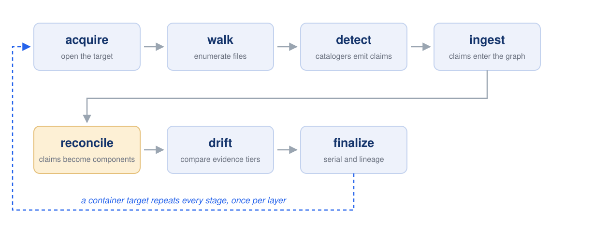
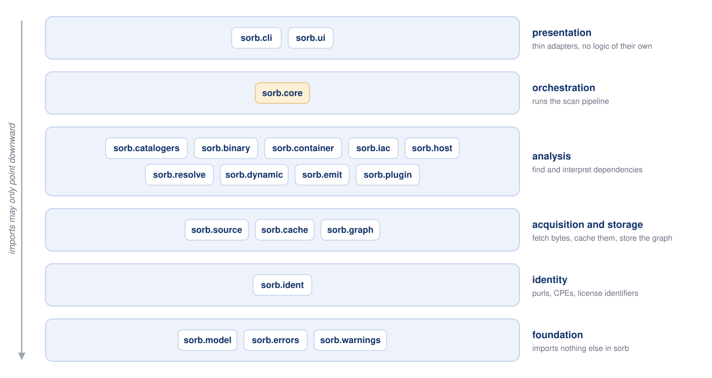

# Architecture

This document describes how `sorb` is built, for contributors. For what it
does and how to use it, see [`usage.md`](./usage.md).

## Design principles

- **Evidence first.** Nothing is asserted without recorded evidence. Every
  component in an SBOM traces back to concrete occurrences (a lockfile entry, a
  package-DB record, an embedded buildinfo section, a runtime observation),
  each with a file/span reference, an evidence tier, and a confidence score.
- **Offline first.** A scan never touches the network unless explicitly
  allowed (`--allow-net`); `--offline` disables network access entirely. There
  is no telemetry.
- **Contained failure.** One unparseable file must not end a scan. A detector
  failure becomes a warning plus an `analysis-gap` annotation on the affected
  scope, and the scan continues — the result says what could not be read
  rather than pretending it was not there.
- **Pure Python is the reference.** The optional native accelerator
  (`sorb-accel`) is used only after a load-time check proves its output
  byte-identical to the pure implementation, so it can change how long a scan
  takes but not what it finds.
- **Determinism.** With `--reproducible`, output is byte-identical across runs
  (canonical JSON serialization, `SOURCE_DATE_EPOCH` honored).

## Process model

A scan runs as one process, with no daemon and no worker pool:



Container targets (`image:`, `oci-dir:`, `docker-archive:`, `docker:`,
`podman:`, `containerd:`, `container://`) dispatch to a container-scan
orchestrator that runs the same stages per layer; directory, file, host, and
disk targets run the flow directly. Every stage publishes progress events to a
bus that renders as TTY output or NDJSON logs.

Separate processes appear in exactly three places, each a trust boundary:

1. `--resolve=native` - the ecosystem's own build tool, inside a
   deny-by-default sandbox.
2. `sorb trace` - the traced target command, observed from outside.
3. gRPC plugins - explicitly-trusted external cataloger processes.

## Package layering

Imports point strictly downward; the boundary is enforced in CI by
import-linter (see the contract in `pyproject.toml`):



A few sanctioned cross-seams exist where a cataloger wraps a sibling
subsystem's parsers (binary formats, IaC parsers, the Windows registry
reader); each is listed explicitly in the import-linter contract.

Heavy imports happen inside subcommand bodies so `sorb --help` stays fast
(<300 ms budget, enforced by `sorb bench`).

## Domain model (`sorb.model`)

Frozen dataclasses, serializable to/from JSON:

- **`ComponentClaim`** - "detector X believes component C is present", with
  `Coordinates` (name/version/ecosystem/purl), a `Scope` (runtime/dev/…), and
  an evidence `Tier`.
- **`EvidenceRecord`** - the concrete occurrence backing a claim: source file,
  byte span, detector id/version, and the raw matched content's digest.
- **`EdgeClaim` / `EdgeType`** - dependency and provenance edges
  (DEPENDS_ON, RESOLVED_FROM, CONTAINS, …).
- **`Tier`** - an ordered ladder of evidence quality: declared < locked <
  installed < observed. Higher tiers dominate during reconciliation;
  `--paranoid` filters to locked-or-better.
- **`Annotation`** - structured findings attached to components or the run
  (drift codes, analysis gaps, stale lockfiles, …). Policy gates
  (`--fail-on`) match on annotation codes.
- **`Finding`** - the unit a detector yields: claims + evidence + edges +
  annotations.

Confidence is computed during reconciliation from the evidence that agrees
and disagrees. Independent sources each raise the score without any one of them
reaching certainty (a noisy-OR combination), starting from per-technique base
rates in `sorb/data/base_rates.toml` and capped by the highest evidence tier
present. Every score is therefore derived rather than assigned, and
`sorb explain` prints the derivation.

A claim that names a package without resolving it (a manifest range, a
build-system requirement) carries its spec in `requested` and no version - a
range is not a version, and emitting one as if it were would invent a
component that was never built. All such claims for the same package merge
into one component, which is pinned if any tier resolved it and otherwise
emitted unresolved with a **versionless purl**, so downstream tooling still
has an identity to match on rather than a bare name.

## Sources (`sorb.source`)

`open_target()` turns a target string into a `Source` that yields `Entry`
objects (path + lazy bytes) with gitignore-aware walking and role
classification (source/vendored/docs/…). Implementations: directory/file,
archives, container layers (via `sorb.container`), a running host
(`host://` - targeted store discovery instead of a full-disk crawl), and disk
images (`disk://` - raw/MBR/GPT/FAT parsed in-process; ext4/NTFS/qcow2/… via
the optional `dissect` backend). Offline Windows analysis reads registry
hives directly (`sorb.host.regf`).

## Catalogers (`sorb.catalogers`)

A cataloger declares `Matcher`s (basename or glob patterns) and a
`parse(ctx, entry, blob) → Iterable[Finding]` method. A dispatch table routes
each walked entry to every cataloger whose matchers accept it, so adding a
format does not touch the walk.

Two kinds exist. Most lockfiles are declarative and need no parser code: one
`LockfileSpec` entry in `table_specs.py` produces a working cataloger with
evidence spans, purls and hashes. Formats that are not JSON/YAML/TOML, or whose
identity needs real work, get a hand-written cataloger instead.

[`support.md`](./support.md) lists every format currently read; it is the one
place that list is maintained.

## Binary analysis (`sorb.binary`)

In-process parsers for ELF/PE/Mach-O/WASM produce link graphs (what links
against what) and dynamic symbol tables with their version requirements,
extract embedded ground truth (Go buildinfo, Rust
cargo-auditable, .NET CLR assembly identity), unpack installers/firmware, and
fingerprint stripped/statically-linked libraries against signature data packs
(`sorb db`). Everything is bytes-in, claims-out - no execution of the target.

## Containers (`sorb.container`)

Layer-accurate image scanning: registry-direct pulls (no daemon required),
OCI layouts, docker-save archives, daemons/containerd, and running
containers. Per-layer attribution, base-image splitting, package-DB time
travel (what each layer added/removed), attestation verify-and-ingest, and
distroless inventories. `--all-platforms` fans out over a multi-arch index.

## Resolvers (`sorb.resolve`)

Pure, network-free reimplementations of ecosystem resolution (npm semver, Go
MVS, Maven version mediation) used to *verify* lockfiles against manifests -
drift like stale lockfiles and version conflicts becomes annotations, not
guesses.

## Dynamic observation (`sorb.dynamic`)

- **Sandbox** - deny-by-default sandboxes that run native build tools for
  `--resolve=native`: user/mount/net namespaces plus a seccomp filter on Linux,
  a generated Seatbelt profile on macOS. There is no Windows implementation -
  a restricted token has to be applied at process creation, which `subprocess`
  cannot do - so `--resolve=native` refuses there rather than running the build
  tool unconfined. Helper scripts a driver needs are declared
  (`NativeDriver.scratch_files`) and materialized by the sandbox, so they land
  inside whatever filesystem the child actually sees.
- **Trace** - `sorb trace`/`watch` observe what a process actually loads:
  privilege-free interpreter hooks (Python `sitecustomize`, Node preload) plus
  kernel file-tracing backends, mapped back onto the evidence graph as
  observed-tier findings. `sorb snapshot` diffs installed state around a
  provisioning step.

## Storage (`sorb.graph`, `sorb.cache`)

- **Run store** - each scan writes one SQLite database
  (`.sorb/results/<run-id>.sorb.db`) holding the full evidence graph:
  components, edges, evidence, annotations, run metadata. Migrations live in
  `sorb/graph/migrations/`. Every downstream command (`explain`, `query`,
  `diff`, `ui`, `fleet`) reads these stores; the native `sorb` output format
  is a lossless export of the same graph.
- **Cache** - a content-addressed store keyed by (file digest, detector
  id+version) that makes re-scans incremental (`--cache`). An optional shared
  HTTP twin (`--remote-cache`, `sorb cache serve`) is fail-open: if it is
  down, scans proceed.

## Emitters (`sorb.emit`)

Hand-rolled, dependency-light serializers for CycloneDX 1.6, SPDX 2.3,
SPDX 3.0, and the native format, plus human renderers (table/tree/summary).
Canonical serialization guarantees reproducible bytes. `importers.py` reads
foreign SBOMs back into a graph store, which is what makes
`convert`/`merge`/`diff` any-to-any. `signing.py` implements detached
signatures, DSSE in-toto attestations bound to a subject digest, and the
ordered verification used by `sorb verify` and `sorb self update` - all
air-gapped, key-based. Whenever the artifact being verified is in hand, the
signature must be bound to *its* digest, so a validly-signed attestation about
something else is rejected rather than accepted; `verify_artifact()` is the
gate the executable-trust callers (self-update, WASM plugins, data packs) go
through, and it never treats an unbound subject as good enough.
`validate.py` covers structural, NTIA, and BSI TR-03183 profiles.

## Query engine (`sorb.query`)

A small DSL (`components where … | count by …`, `paths from … to …`) with a
hand-written parser and an engine that runs over any graph store. Shared by
`sorb query`, `sorb fleet -q`, and the UI's `/api/query`. `sorb.host.fleet`
merges many run stores into one graph, deduplicating components by identity
while keeping per-source provenance, so a query over a whole estate returns
rows that name the host each match came from.

## Web UI (`sorb.ui`)

An optional (`[ui]` extra) FastAPI/uvicorn server plus a fully self-contained
SPA (no CDN, no external requests) over the same evidence graph: dashboard,
dependency-graph canvas with level-of-detail management, container layer
stack, visual explain, and a query console. Scans stream into the browser via
SSE. Security posture: loopback bind by default, per-session token auth
(required for non-loopback binds), strict CSP, and DNS-rebinding defense.
`sorb serve` is the headless twin.

## Plugins (`sorb.plugin`)

Three tiers, all producing findings that are re-validated before ingestion
(`validation.py` - a plugin can never inject unchecked claims, impersonate a
first-party detector, or claim more confidence than its technique's base rate):

1. **Entry-point plugins** - trusted Python packages registering catalogers or
   emitters, discovered by installation.
2. **WASM plugins** - untrusted, sandboxed via wasmtime; must be signed, and
   verification reuses the DSSE machinery. `wasm.py` implements the host side of
   a small linear-memory ABI (`docs/plugins.md`); a trap, fuel exhaustion, or
   oversized return degrades to an analysis gap.
3. **gRPC plugins** - out-of-process services, contacted only with explicit
   trust, TLS by default. Messages are encoded by `plugin/wire.py` against
   `plugin/proto/plugin_v1.proto`, so the extra needs a transport but no
   generated stubs.

Unlike entry points, the two out-of-process tiers are opt-in per project
(`[plugins]` in `sorb.toml`, loaded by `plugin/config.py`) - running them is a
decision the project has to make explicitly. A tier that cannot be loaded
degrades to a warning (`SORB-W064`/`SORB-W065`), never a failed scan.

## Acceleration (`sorb.accel`, `native/sorb-accel`)

Three hot paths (tree walk+hash, tar streaming, fingerprint matching) sit
behind an interface with a pure-Python reference implementation. The optional
Rust wheel is adopted at load time only if a self-check proves its hashing
byte-identical; `--no-accel`/`SORB_NO_ACCEL` force the reference. `sorb accel`
reports the active tier.

## Errors and exit codes (`sorb.errors`)

A small taxonomy maps to stable exit codes: 0 success, 1 scan errors,
2 policy failure, 3 usage error, 4 internal error. `DetectorFailure` is the
containment workhorse: caught per file, recorded as a warning +
`analysis-gap` annotation, never propagated. Warning codes (`SORB-Wxxx`) are
a documented registry (`sorb/data/warnings.toml`, `sorb explain-warning`).

## The CLI

`sorb.cli` is a presentation layer and nothing more: parse arguments, call into
`sorb.core`, render the result. It is split by what a user is trying to do, so
a command is easy to find and a new one has an obvious home:

| Module | Commands |
| --- | --- |
| `cli/app.py` | the Typer application and its sub-groups |
| `cli/commands/scan.py` | `scan` |
| `cli/commands/inspect.py` | `explain`, `explain-warning`, `layers`, `query` |
| `cli/commands/interop.py` | `convert`, `merge`, `diff`, `validate`, `fleet` |
| `cli/commands/security.py` | `sign`, `attest`, `verify` |
| `cli/commands/observe.py` | `trace`, `snapshot`, `watch` |
| `cli/commands/serve.py` | `ui`, `serve` |
| `cli/commands/admin.py` | `bench`, `accel`, `config`, `cache`, `db`, `self` |
| `cli/render.py` | output formats and `--fail-on` policy evaluation |

Importing a command module registers its commands, so `cli/main.py` only
assembles them. Anything expensive is imported *inside* a command body, which
is what keeps `sorb --help` inside its 300 ms startup budget.

## Repository layout

```
src/sorb/            the package (layout mirrors the layering above)
tests/               unit, e2e, corpus, differential suites
native/sorb-accel/   optional Rust accelerator crate
data-packs/          signature data-pack build tooling
packaging/           Homebrew formula, winget manifest, PyInstaller spec
fuzz/                OSS-Fuzz integration
examples/            example entry-point plugin
.github/workflows/   CI (lint, types, layering, tests, gates) and release
```
